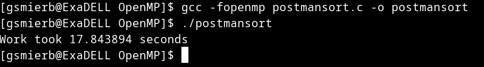
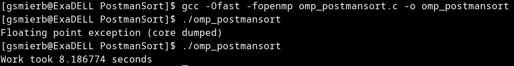
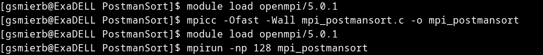

# Integrantes:
Gian Sebastian Mier Bello - 2210073

Santiago González Flores - 2200165

## Binary Search:
Este código implementa dos funciones principales: <strong>bubble_sort</strong> y <strong>binary_search</strong>, que respectivamente ordenan una lista de números y buscan un valor específico en esa lista.

<strong>Bubble_sort:</strong> Esta función ordena una lista de números utilizando el algoritmo de ordenamiento de burbuja. El algoritmo recorre la lista múltiples veces, comparando elementos adyacentes y intercambiándolos si están en el orden incorrecto. Este proceso se repite hasta que no se requieran más intercambios, lo que indica que la lista está ordenada de forma ascendente.

<strong>Binary_search:</strong> Esta función busca un valor específico en una lista ordenada utilizando el algoritmo de búsqueda binaria. Este algoritmo divide repetidamente la lista por la mitad y compara el valor buscado con el elemento en el medio de la lista. Si el valor buscado es igual al elemento medio, se devuelve que se ha encontrado. Si el valor buscado es menor que el elemento medio, la búsqueda se realiza en la mitad inferior de la lista. Si es mayor, la búsqueda se realiza en la mitad superior. Este proceso se repite hasta que se encuentre el valor buscado o hasta que la lista se reduzca a cero, lo que indica que el valor no está presente en la lista.

Para la ejecución de los programa pedimos una reserva interactiva:
```
srun -n 4 --pty /bin/bash
```
### Código MPI:


<strong>Explicación:</strong>
Se inicializa MPI y se declara variables como el rango (rank), el tamaño (size), la clave a buscar (key), una lista de tamaño fijo (list), y variables para medir el tiempo de ejecución. Luego, se divide la lista en sublistas para que cada proceso MPI pueda ordenar una porción de ella. Utilizando MPI_Scatter, se distribuye la lista entre los procesos. Se inicia el temporizador y se ordena cada sublista utilizando el algoritmo de ordenamiento de burbuja en la función bubble_sort(). Posteriormente, se utiliza MPI_Gather para reunir las sublistas ordenadas en el proceso raíz. Los procesos MPI se sincronizan y se mide y muestra el tiempo tomado para ordenar la lista.

Si el proceso es el raíz, se lee la clave de búsqueda. Utilizando MPI_Bcast, se transmite la clave de búsqueda a todos los procesos. Se inicia el temporizador y cada proceso realiza una búsqueda binaria en su sublista utilizando la función binary_search(). Se sincronizan los procesos MPI y se mide y muestra el tiempo tomado para realizar la búsqueda.

Además, la lista se divide en sublistas iguales para que cada proceso MPI maneje una porción de la lista. La semilla para la generación de números aleatorios se ajusta en función del rango del proceso MPI para garantizar resultados reproducibles y distribución uniforme de números aleatorios. La comunicación MPI se utiliza para distribuir la lista, recolectar sublistas ordenadas y transmitir la clave de búsqueda a todos los procesos.

### Resultados
Para la prueba se usaron n = 100.000, los cuales se seleccionaron de manera aleatoria con la semilla de time y
los resultados con los correspondientes comandos son los siguientes:

#### Binary Search


#### Binary Search OpenMp


#### Binary Search MPI


## Postman Sort:

Este código es la implementación del algoritmo Postman Sort que una variante del Bucket Sort, en este caso se paralelizo con la librería de MPI.

Para ejecutar este código es necesario entrar a guaneExa, luego hacer una reserva interactiva de 128 nucleos.
```
ssh guaneExa
srun -n 128 --pty /bin/bash
```
Tiene que entrar en la carpeta PostmanSort/ despues para compilarlo  se debe cargar la librería MPI y compilarlo:
```
module load openmpi/5.0.1
make clean
make all
```
Finalmente para correrlo:
```
mpirun -np 128 mpi_postmansort
```
### Explicación:
Para paralelizar este algoritmo con MPI, primero el worker raíz inicializo el array e inicio la primera etapa del algoritmo que es un ordenamiento basado en el numero de digitos, luego se difundieron las variables necesarias para el algoritmo (n) a tráves un broadcast, finalmente es necesario asignar una parte equitativa entre el numero de procesos, esto es posible gracias al MPI_Scatter una vez que  cada worker haya ejecutado la segunda etapa de ordenamiento de su parte del array se recolecta estos subarrays con MPI_Gather y se toma el tiempo del worker que mas le haya tomado ordenar el array que sería el tomado como referencia de tiempo total.

### Resultados
Se ejecutaron con 100000 numeros.

#### PostmanSort Secuencial


#### PostmanSort OpenMP


#### PostmanSort MPI



### Conclusiones
* Si bien OpenMP es mas versátil a la hora de ejecutarse en una sola máquina, podemos evidenciar en este caso que al escalar un programa en MPI tiene mejores resultados que OpenMP, ya que al ejecutarlo con pocos workers la sincronización y la comunicación afectan en el rendimiento. Sin embargo la diferencia es imperceptible en este caso.
* Con las bandera de optimización -Ofast se redujeron mas numero de instrucciones que en -O3 y con la ayuda de -Wall se arreglaron los warnings del programa. 

