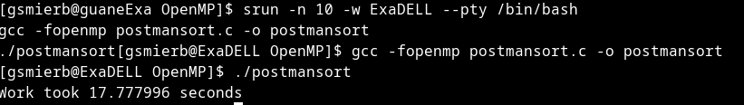
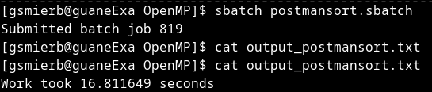

## Postman Sort
<p>Es un algoritmo de ordenamiento de complejidad:  </p>
<ul>
  <li>Complejidad temporal = $$d * (n + k)$$</li>
  <li>Complejidad espacial = $$n + 2^d$$ </li>
</ul>
<p>Donde d es el numero de digitos, n el numero de datos y k el numero de baldes </p>
Este algoritmo es una variante del  <strong>Bucket Sort</strong> que aprovecha la jerarquía estructural
de los elementos, permite agrupar los elementos en subgrupos en este caso con digitos similares y asi reordena los subgrupos
para dar una lista ordenada.

Para ejecutar este programa es necesario entrar a <strong>guaneExa</strong>
```
ssh guaneExa
```
Para compilar el código secuencial se tiene que ejecutar el siguiente comando (Cabe aclararar que se usa OpenMP para medir los tiempos):
```
srun -n 10 -w ExaDELL --pty /bin/bash
gcc -fopenmp postmansort.c -o postmansort
./postmansort
```
Para ejecutar el código paralelizado basta con ejecutar el siguien SBATCH
```
sbatch postmansort.sbatch
```
### Resultados
Para la prueba de ordenamiento se usaron N=100000 numeros del 0 al 10000, los cuales se seleccionaron de manera randomica con la semilla de time y
los resultados fueron los siguientes:
#### Secuencial


#### Paralelo


En paralelo se optimizó el for mas interno que organizaba los numeros de cada uno de los buckets, mediante un `schedule` con un tamaño dinamico de hilos.
### Conclusiones
<ul>
  <li>Si bien el paralelismo optimiza los tiempos de ejecución de los programas, no es la solucion mas adecuada para ciertos tamaños. Por ejemplo: para pocos datos </li>
  <li>Se optimizó el tiempo de ejecución mediante las librerías de OpenMP para un numero bastante considerado de datos.</li>
  <li>Este algoritmo depende en gran medida de agrupar datos de la misma jerarquía lo que hace dificil la optimización del  mismo, se usaron otras herramientas de la librería 
  para mejorar estos tiempo sin embargo el vector acaba parcialmente ordenado en ciertas posiciones.</li>
</ul>
